# termf1 🏎 

> **A full-featured Formula 1 terminal UI** built with Go and [Charm](https://charm.sh/)

Real race analysis, live standings, circuit track maps, pit stop insights, AI chat, and a growing deep-dive **Race Analysis** mode — all in your terminal.

[](https://golang.org)
[](https://openf1.org)
 <a href="https://www.buymeacoffee.com/devkeshwan1" target="_blank"></a>

---

## What's new in v2

### Race Analysis view (new major feature)

A dedicated deep-dive view for any completed session — navigate to any race weekend and explore 9 interactive charts:

| # | Chart | What you see |
|---|-------|--------------|
| ① | **Strategy** | Per-driver tyre stint timeline — compound colours, lap counts, undercut/overcut windows |
| ② | **Sparklines** | Per-driver lap-time sparklines across the full race — identify degradation and purple laps at a glance |
| ③ | **Pace** | Box-plot style pace distribution per driver — median, spread, outlier laps |
| ④ | **Sectors** | Sector-by-sector time breakdown per driver across all laps |
| ⑤ | **Speed Trap** | Top-speed trap readings per driver — straight-line performance comparison |
| ⑥ | **Positions** | Position changes chart — every driver's race trajectory lap-by-lap, right-anchored finish sidebar |
| ⑦ | **Team Pace** | Constructor-level pace comparison — team median vs field |
| ⑧ | **Pit Stops** | Ranked pit stop duration bar chart (see below) |


## Views

| # | Tab | What you get |
|---|-----|--------------|
| 1 | **Dashboard** *(WIP)* | Live timing — being rebuilt on top of the official F1 live-timing protocol |
| 2 | **Standings** | Driver & Constructor championship standings with team-coloured proportional bar charts |
| 3 | **Schedule** | Full season calendar grouped by month. Cursor-navigate with `j`/`k`. Next race auto-highlighted |
| 4 | **Weather** | Air temp, track temp, humidity, pressure, wind speed/direction, rainfall + sparkline trend charts |
| 5 | **Ask AI** | Chat with Groq's `compound-beta` model (live web search) — race strategy, regulations, history |
| 6 | **Track Map** | Real circuit outlines rendered from GPS coordinate data. Corner numbers overlaid. `s` to simulate any GP, along with Heatmaps of driver speed | more (WIP)
| 7 | **Driver Stats** | Per-driver lap-time sparklines, best/avg/worst laps, sector trends, lap histogram, pit stop counts |
| 8 | **Race Analysis** | 9-chart deep-dive for any session — strategy, pace, positions, pit stops, sectors, speed |

---

## Screenshots

### Dashboard & Core Views

| | |
|---|---|
| 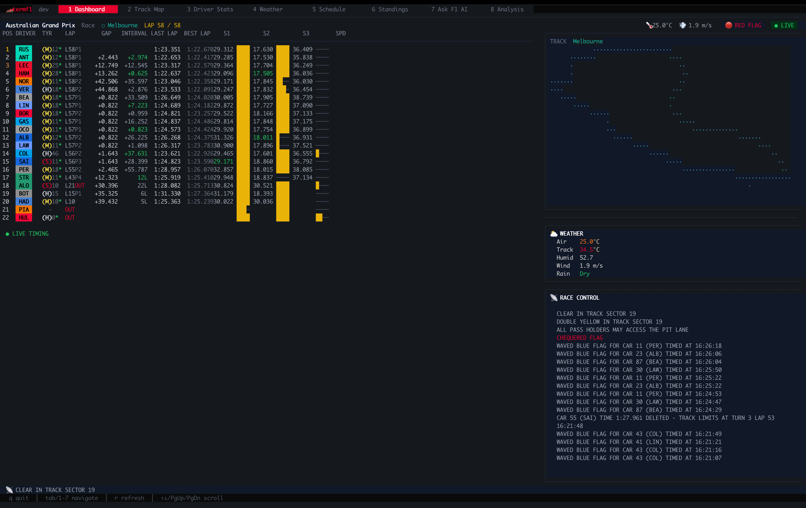 | 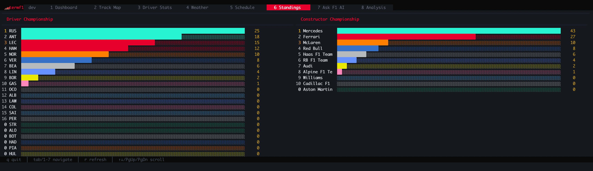 |
| **Dashboard** — Live timing (v3 rebuild in progress) | **Standings** — Driver & Constructor standings with team bar charts |
| 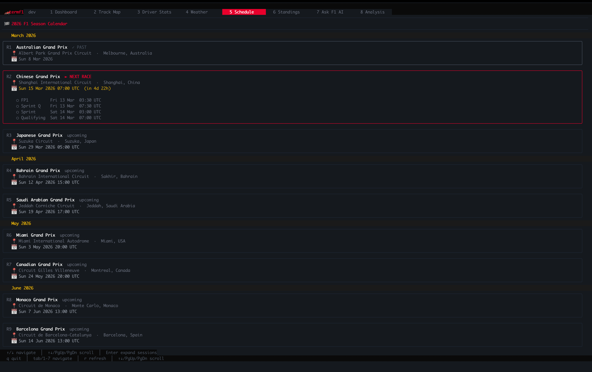 | 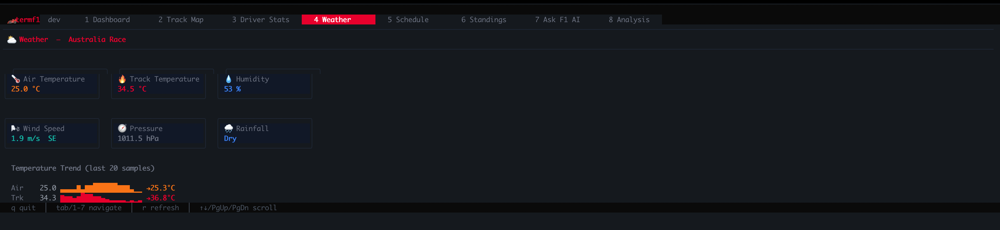 |
| **Schedule** — Season calendar with session detail | **Weather** — Real-time track & air conditions with sparklines |
| 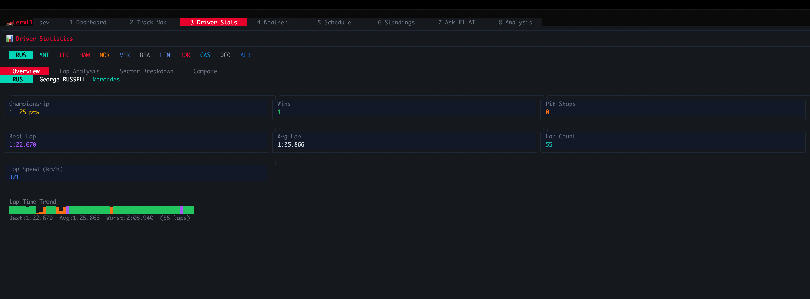 | 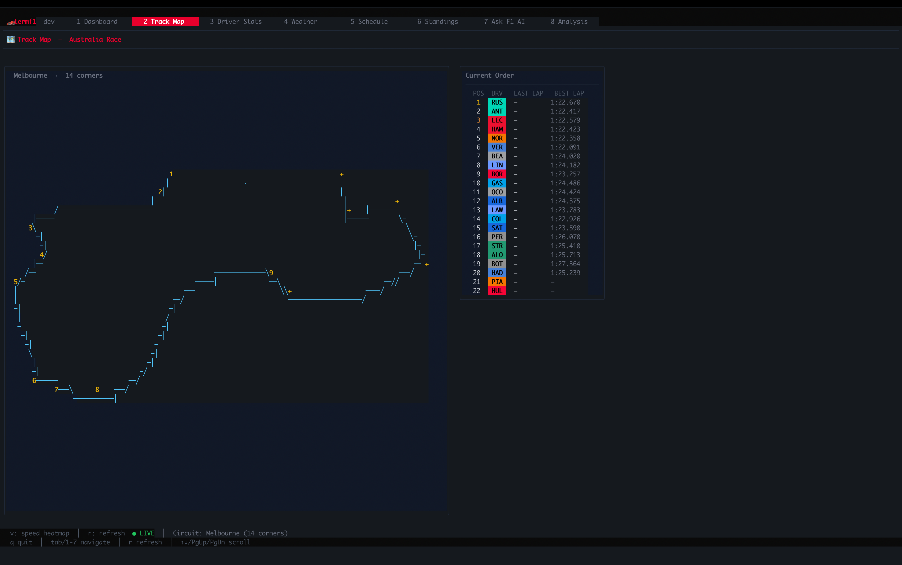 |
| **Driver Stats** — Lap analysis, sectors, histogram | **Track Map** — Real GPS circuit outline with corner labels |

### Race Analysis — 9 Charts

| | |
|---|---|
| 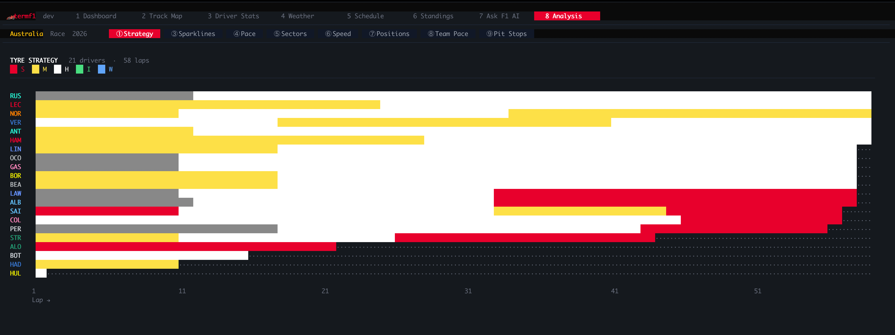 | 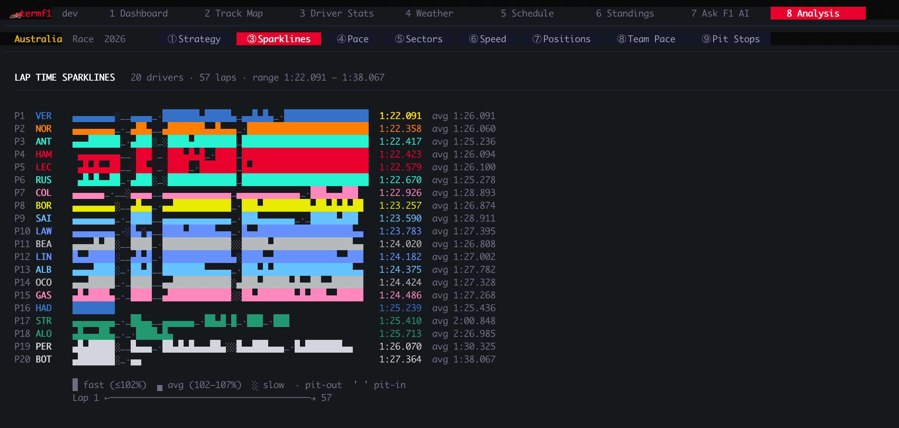 |
| **① Strategy** — Tyre stint timeline with compound colours | **② Sparklines** — Per-driver lap-time sparklines |
| 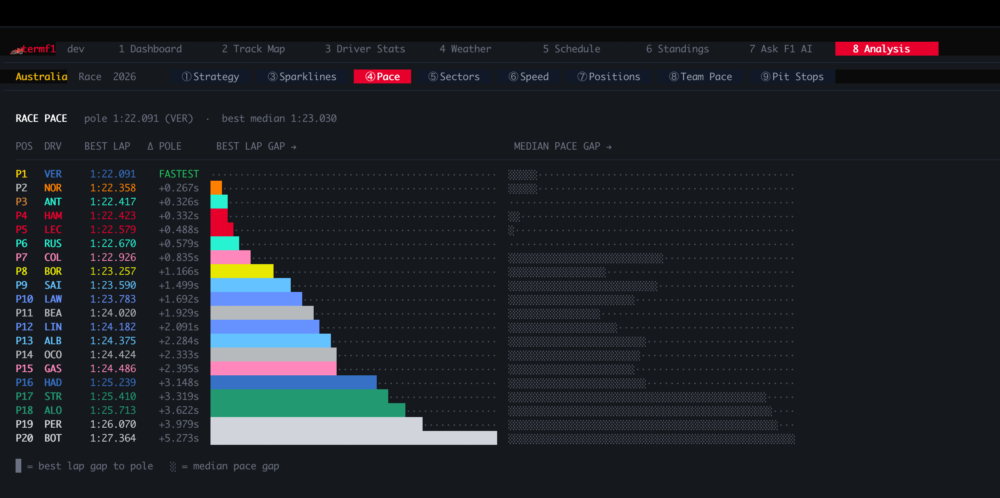 | 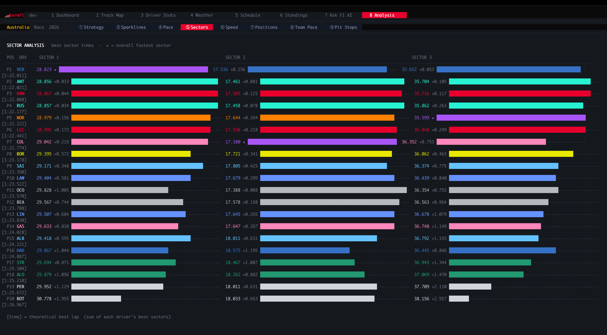 |
| **③ Pace** — Race pace distribution per driver | **④ Sectors** — Sector breakdown across all laps |
| 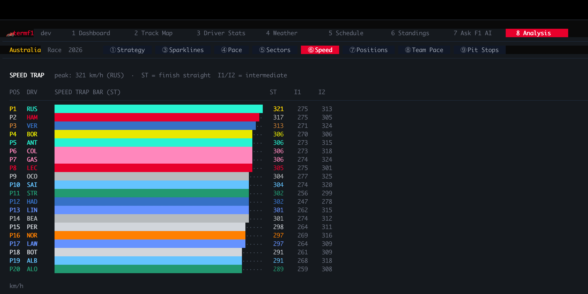 | 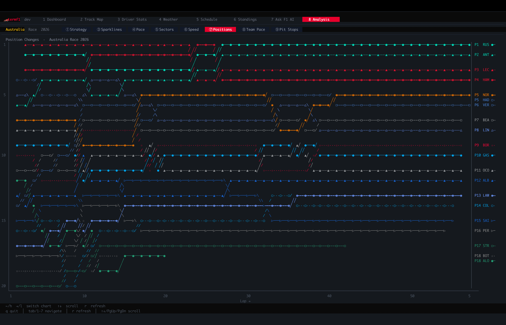 |
| **⑤ Speed Trap** — Top speed by driver | **⑥ Positions** — Race position changes lap-by-lap |
| 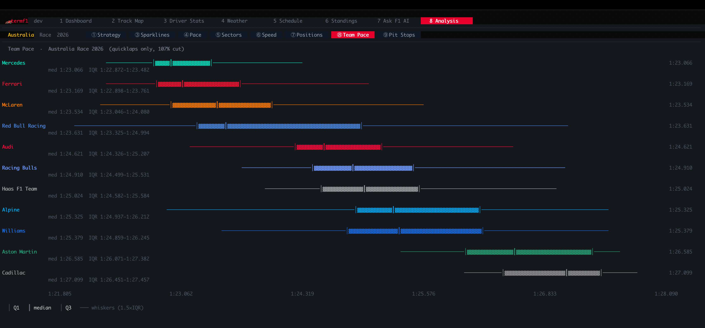 | 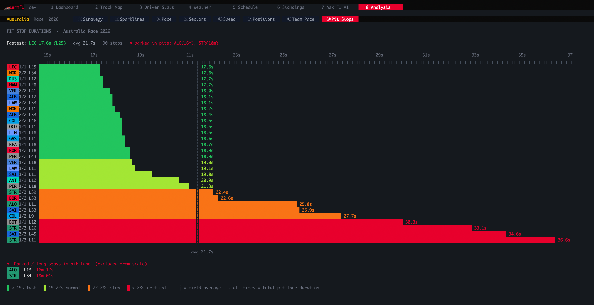 |
| **⑦ Team Pace** — Constructor-level pace comparison | **⑧ Pit Stops** — Ranked stop durations with tier colouring |

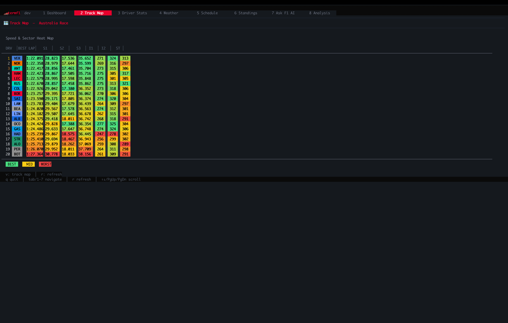
**Speed Heatmap** — Full-field speed trace overlaid on circuit

---

## Install

### Option 1 — Download pre-built binary (recommended)

Go to [Releases](https://github.com/dk-a-dev/termf1/releases/latest) and download the archive for your platform:

| Platform | File |
|----------|------|
| macOS (Apple Silicon) | `termf1-v2.x.x-darwin-arm64.tar.gz` |
| macOS (Intel) | `termf1-v2.x.x-darwin-amd64.tar.gz` |
| Linux x86-64 | `termf1-v2.x.x-linux-amd64.tar.gz` |
| Linux ARM64 | `termf1-v2.x.x-linux-arm64.tar.gz` |
| Windows x86-64 | `termf1-v2.x.x-windows-amd64.zip` |

```bash
# macOS / Linux example
tar xzf termf1-v2.x.x-darwin-arm64.tar.gz
export GROQ_API_KEY=your_key_here
./termf1
```

### Option 2 — Build from source

```bash
git clone https://github.com/dk-a-dev/termf1
cd termf1
cp .env.example .env   # fill in your GROQ_API_KEY
source .env
make run
```

Install globally to `$GOPATH/bin`:

```bash
make install   # then just: termf1
```

### Option 3 — `go install` (requires Go 1.22+)

```bash
export GROQ_API_KEY=your_key_here
go installgithub.com/dk-a-dev/termf1/v2@latest
termf1
```

---

## Requirements

- Go 1.22+
- A 256-colour / true-colour terminal (iTerm2, Ghostty, kitty, WezTerm, etc.)
- [Groq API key](https://console.groq.com) — free tier is sufficient for the Ask AI tab

## Configuration

Copy `.env.example` to `.env` and set:

```env
GROQ_API_KEY=your_groq_api_key_here   # required for Ask AI
GROQ_MODEL=compound-beta              # default; supports any Groq model
REFRESH_RATE=5                        # seconds between live-data polls
```

---

## Keybindings

| Key | Action |
|-----|--------|
| `1`–`8` | Jump to tab |
| `Tab` / `Shift+Tab` | Cycle tabs |
| `↑` `↓` / `j` `k` | Scroll / move cursor |
| `r` | Refresh current view |
| `q` / `Ctrl+C` | Quit |
| **Schedule** | |
| `Enter` / `Space` | Expand race session detail |
| **Track Map** | |
| `s` | Toggle Australian GP simulation |
| **Driver Stats** | |
| `←` `→` / `h` `l` | Previous / next driver |
| `t` | Switch sub-tab (Overview → Lap Analysis → Sectors) |
| **Race Analysis** | |
| `←` `→` / `h` `l` | Previous / next chart |
| `Enter` | Select race from session picker |
| **Ask AI** | |
| `Enter` | Send message |
| `Esc` | Blur input (enables viewport scroll) |
| `Ctrl+L` | Clear chat history |

---

## Data sources

| Source | Used for |
|--------|----------|
| [OpenF1 API](https://openf1.org) | Sessions, laps, positions, stints, pit stops, weather, speed trap |
| [Jolpica / Ergast API](https://jolpi.ca) | Championship standings, full season calendar |
| [Multiviewer API](https://api.multiviewer.app) | Real GPS circuit coordinate data for track maps |
| [Groq API](https://groq.com) | AI chat with live web search (`compound-beta`) |

---

## v3 Roadmap

### Live timing server (`termf1-server`)

A custom Go server that connects to the official F1 live-timing SignalR feed (`livetiming.formula1.com`) and broadcasts a clean WebSocket/JSON stream that the TUI subscribes to:

- [ ] Reverse-engineered SignalR handshake + subscription topics: `TimingData`, `CarData.z`, `Position.z`, `RaceControlMessages`, `TeamRadio`, `SessionInfo`
- [ ] Real-time sector splits and mini-sectors per car
- [ ] Per-car telemetry: speed, throttle %, brake %, gear, RPM, DRS state
- [ ] Race control messages (SC, VSC, red flag, penalties) piped live into the dashboard header
- [ ] Live gap tree: delta to leader, delta to car ahead, racing interval
- [ ] On-track battle detection — automatic highlight when two cars are within 1 s

### Dashboard revival (v3 major focus)

Rebuild the dashboard as a **unified live race command centre**:

- [ ] Animated driver dots on the real circuit outline (GPS X/Y positions from `Position.z`)
- [ ] Side-by-side track map + live timing table + mini gap sparklines
- [ ] Real tyre age counters ticking per lap
- [ ] Weather overlay: real-time track/air temp, rain probability
- [ ] Team radio clips — playback URLs streamed from `TeamRadio` topic

### Race Analysis enhancements

- [ ] Tyre degradation model — fitted lap-time slope per stint, visualised as a trendline on sparklines
- [ ] Undercut/overcut detection — flag when a driver gained/lost position via pit stop timing
- [ ] Interactive session picker UI (rather than config flag)
- [ ] Head-to-head driver comparison mode across any two drivers
- [ ] Animated replay of race positions chart with a lap scrubber

---

## Project layout

```
termf1/
├── main.go
├── termf1-server            ← live-timing server binary (v3 WIP)
├── python/
│   └── analysis.ipynb       ← data exploration notebook
├── internal/
│   ├── config/              ← env var loading
│   ├── api/
│   │   ├── openf1/          ← OpenF1 REST client, typed models (Session, Lap, Stint, Position, Pit…)
│   │   ├── jolpica/         ← Jolpica/Ergast client (standings, calendar)
│   │   ├── groq/            ← Groq chat completions client
│   │   └── multiviewer/     ← Multiviewer circuit coordinate client
│   └── ui/
│       ├── app.go           ← root Bubbletea model, tab navigation, header/footer
│       ├── styles/          ← Lipgloss colour palette, team/tyre colour helpers
│       └── views/
│           ├── dashboard/   ← [WIP v3] live timing command centre
│           ├── standings/   ← championship standings + bar charts
│           ├── schedule/    ← scrollable calendar with month grouping
│           ├── weather/     ← weather cards + sparklines
│           ├── chat/        ← Groq AI chat
│           ├── trackmap/    ← real circuit renderer + simulation mode
│           ├── driverstats/ ← per-driver stats, graphs, sector breakdown
│           └── analysis/    ← Race Analysis — 9 charts
│               ├── model.go       chart state, data messages
│               ├── fetch.go       parallel OpenF1 data fetching
│               ├── charts.go      chart dispatcher + shared helpers
│               ├── strategy.go    tyre stint timeline
│               ├── laptimes.go    lap-time sparklines
│               ├── pace.go        pace distribution
│               ├── sectors.go     sector breakdown
│               ├── speedtrap.go   speed trap comparison
│               ├── positions.go   position changes chart
│               ├── teampace.go    constructor pace comparison
│               └── pitstops.go    pit stop duration ranked chart
```

